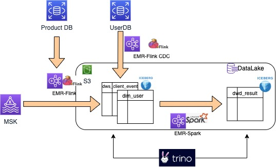

# iceberg-emr-demo

请产考
Blog：https://aws.amazon.com/cn/blogs/china/using-apache-iceberg-to-build-quasi-real-time-data-warehouse-on-aws/

**架构图**

工程说明：
gendata：动态产生测试数据input到MSK

flink-iceberg-demo： 实时消费MSK数据入湖

sql： mysql 建表ddl 和测试使用SQL

